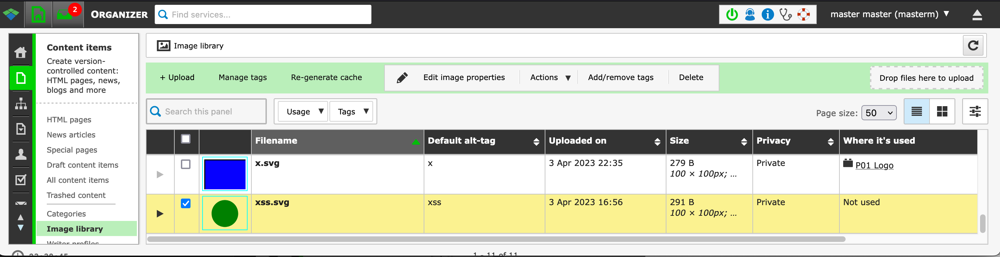
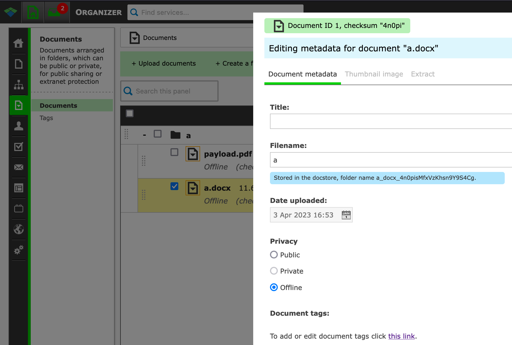
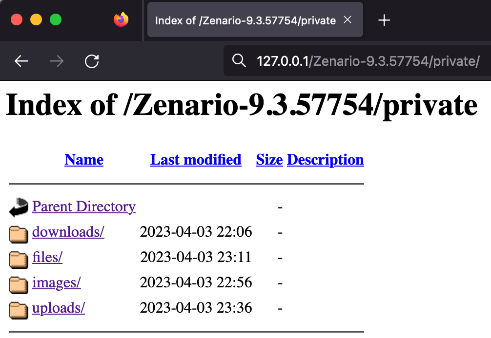
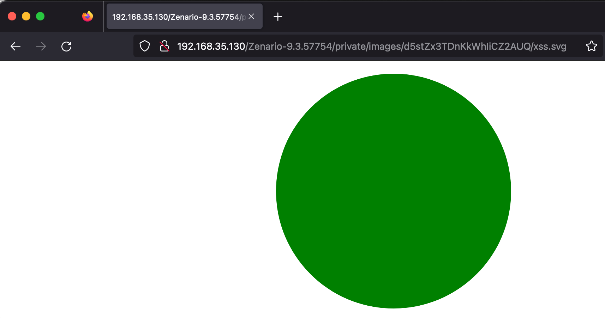
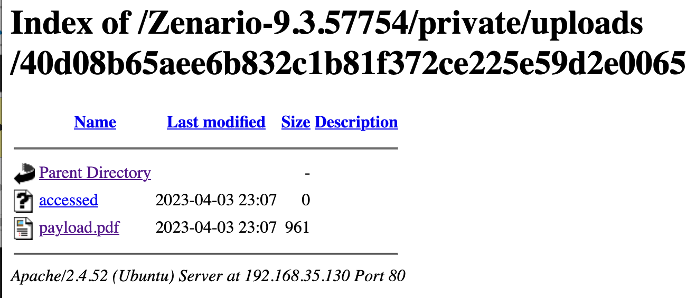

# Tribal Systems Zenario CMS 9.3.57754 Exposure of Sensitive File via Private Folder

Description: In Zenario CMS user session identifier (authentication token) is issued to the browser prior to authentication but is not changed after user logout and login again into the application when "Remember me" option active. Failing to issue a new session ID following a successful login introduces the possibility for an attacker to set up a trap session on the device the victim is likely to login with.

The product(s): https://zenar.io

Affected product(s)/code base: https://github.com/TribalSystems/Zenario

Affected component(s): /Zenario-9.3.57754/private

Tested version: Zenario-9.3.57754

# Proof of Concept

## Images and Documents are stored in server with Private and Offline mode.

Images are in Private mode

Documents are in Offline mode

## But the a folder named "private" contains that Images and Documents. This folder can be access by unauthorized actors.

List of private directory

Private image is public

Offline document is public